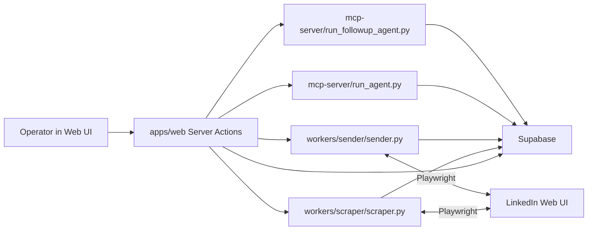

# LinkedinOutreach Architecture (Current State)

## Purpose
This document describes the current production behavior of the monorepo as implemented now (web app, scraper, sender, MCP agent, Supabase).

## System Boundary
- UI and orchestration: `apps/web` (Next.js server actions + pages)
- Enrichment and inbox scanning: `workers/scraper`
- Message sending and followup delivery: `workers/sender`
- AI draft generation: `mcp-server`
- Persistence and workflow state: Supabase (`leads`, `drafts`, `followups`, `outreach_sequences`, `lead_batches`, `settings`)

## High-Level Architecture

## Data Model (Operational)
### `leads`
- Primary workflow state machine (`NEW`, `ENRICHED`, `DRAFT_READY`, `APPROVED`, `SENT`, plus connect-only statuses).
- Stores outreach routing and telemetry: `outreach_mode`, `sequence_id`, `sequence_step`, `connection_sent_at`, `connection_accepted_at`, `last_reply_at`, `followup_count`.

### `drafts`
- Draft copy generated from enriched profile/activity.
- Final outbound message source for connect+message flow (`final_message` / composed opener-body-cta).

### `followups`
- Post-send queue for reply responses and nudges.
- Lifecycle: `PENDING_REVIEW -> APPROVED -> PROCESSING -> SENT`, plus `SKIPPED`, `FAILED`, `RETRY_LATER`.
- Typing: `followup_type` in (`REPLY`, `NUDGE`).
- Context for AI and sender attribution: `last_message_text`, `last_message_from` (`us` or `lead`).

### `outreach_sequences`, `lead_batches`
- Global sequence templates and CSV batch assignment.
- Connect-only accepted-message automation and nudges are sourced from sequence messages.

### `settings`
- LinkedIn credentials (`linkedin_credentials`) and other runtime knobs.

## Runtime Entry Points
- Web UI manual controls:
  - `CHECK INBOX` -> spawn `scraper.py --inbox --run`
  - `SEND APPROVED` (followups) -> spawn `sender.py --followup`
  - Lead send actions -> spawn `sender.py` or `sender.py --message-only`
- Local orchestrator:
  - `run_all.sh` can launch `sender.py` poller and `sender.py --message-only` poller.
  - Inbox scan is not auto-looped in `run_all.sh`; it is manual from UI unless externally scheduled.

## Core Flows
### 1) Connect+Message flow
1. Lead import creates `NEW` leads.
2. Scraper enriches `NEW` -> `ENRICHED`.
3. MCP agent (`run_agent.py`) creates `drafts` and moves leads to draft-ready status.
4. Approve action sets `APPROVED`.
5. Sender (`sender.py`) opens LinkedIn profile, resolves message surface, sends, and marks lead `SENT`.

### 2) Connect-only acceptance flow
1. Leads go through connect-only statuses (`CONNECT_ONLY_SENT` etc.).
2. `sender.py --message-only` checks profile:
   - If invite still pending, skip.
   - If connected (message link visible), send sequence `first_message`, set lead `SENT`, set acceptance timestamps.
3. It auto-schedules two `NUDGE` followups (`attempt=1/2`) with `next_send_at` based on sequence interval.

### 3) Reply and followup flow
1. Inbox scan (`scraper.py --inbox --run`) iterates `SENT` leads, opens each profile conversation, extracts last message, classifies:
   - `REPLY`: last message from lead.
   - `NUDGE`: last message from us and no recent send-block.
2. Scanner inserts `followups` row as `PENDING_REVIEW` with thread context.
3. For `REPLY`, lead `last_reply_at` is updated; `followup_count` updated for all followup inserts.
4. Operator generates/edit draft (via `run_followup_agent.py`) and approves.
5. Sender followup mode sends approved due followups and updates final status.
6. Nudge safety: due NUDGEs are skipped if lead has `last_reply_at` before send.

## Sender Worker Internals
- Modes:
  - Default: send `APPROVED` leads.
  - `--followup`: process approved followups queue.
  - `--message-only`: detect accepted connect-only leads and send sequence step 1.
- Browser/auth:
  - Reuses scraper auth state, falls back to credential login, persists state.
- Message surface detection:
  - Multi-path LinkedIn selector strategy (`message`, `connect_note`, `connect`).
- Delivery semantics:
  - Char limit enforcement and text verification before send click.
  - DB status transitions and failure typing (`FAILED` vs `RETRY_LATER`).

## Operational Characteristics
- Highly state-driven; coordination is mostly through DB statuses.
- Human-in-the-loop for followup approval by default.
- Async workers are process-spawned from web actions or shell loops.
- Idempotency is partial; some flows rely on status gates instead of strict unique event keys.

## Known Drift / Risk Areas
- Reply analytics partly mixes `last_reply_at` and legacy `status='REPLIED'` patterns.
- Legacy `workers/sender/monitor.py` still exists and uses older semantics.
- Followup processing lock is optimistic (`APPROVED -> PROCESSING` update by id) and not atomic under concurrent workers.
